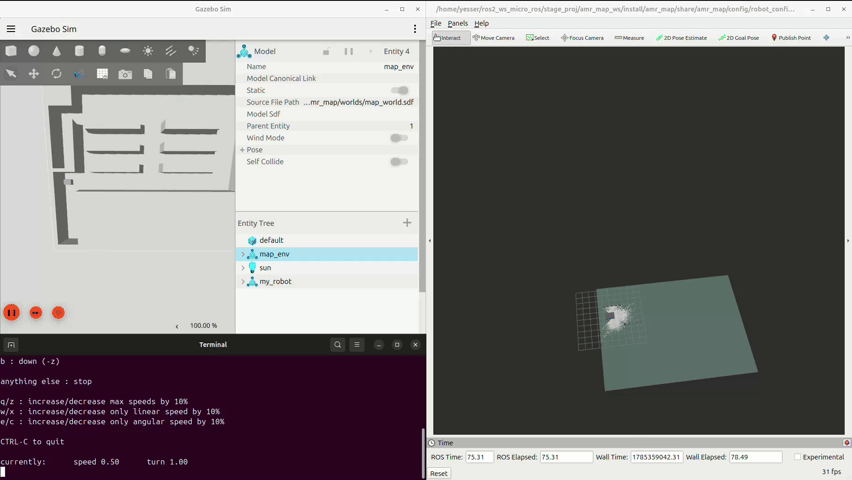
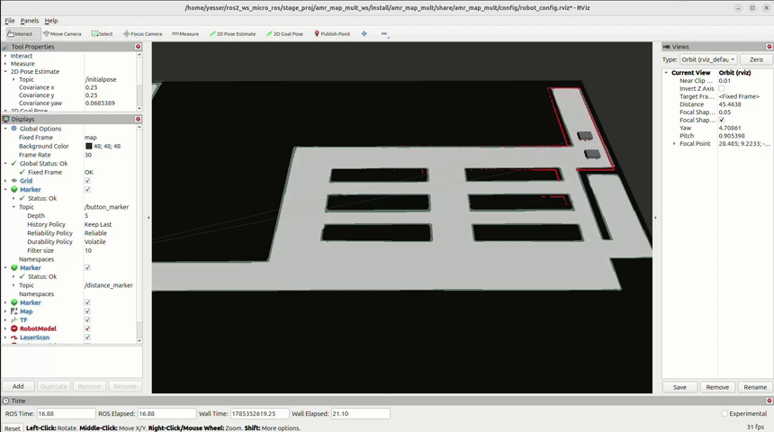
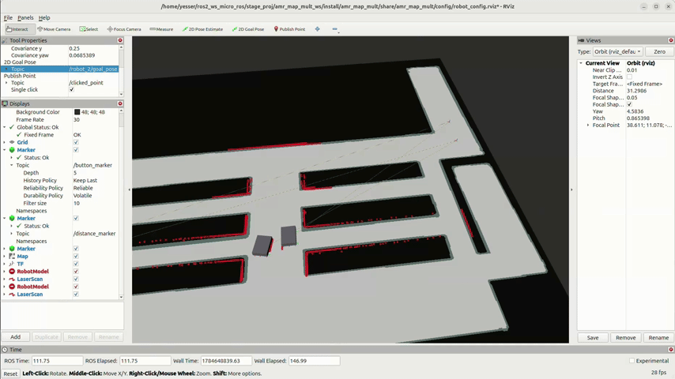

# Multi-AMR Navigation with Fire Alarm Safety Scenario

A ROS2 (Jazzy) project for simulating a fleet of Autonomous Mobile Robots (AMRs) navigating an industrial warehouse environment, with an integrated **fire alarm safety scenario**: when a fire alarm is triggered, robots automatically abandon their normal missions and switch to an evacuation-safe behavior instead.

This project was developed as part of a summer internship at **Timelec** (Socomec Group), based on a fleet of **SEER SLR-1000EU** robots.


## Table of Contents

- [Overview](#overview)
- [Key Features](#key-features)
- [Tech Stack](#tech-stack)
- [Repository Structure](#repository-structure)
- [How It Works](#how-it-works)
  - [1. Mapping (SLAM)](#1-mapping-slam)
  - [2. Single-Robot Navigation](#2-single-robot-navigation)
  - [3. Multi-Robot Navigation](#3-multi-robot-navigation)
  - [4. Fire Alarm Scenario](#4-fire-alarm-scenario)
- [Getting Started](#getting-started)
- [Results](#results)
- [Challenges & Limitations](#challenges--limitations)
- [Acknowledgements](#acknowledgements)

## Overview

The goal of this project is twofold:

1. **Build a multi-robot navigation architecture** allowing several AMRs to autonomously navigate a shared industrial environment and carry out transport missions (moving carts between production zones and a drop-off area).
2. **Add a safety layer for fire emergencies**: when a fire alarm signal is received, the fleet's normal navigation is interrupted and robots switch to a dedicated evacuation-safe behavior, so they don't obstruct personnel while they evacuate.

The whole system was developed and validated in simulation using **ROS2, Nav2, Gazebo, RViz and slam_toolbox**, and is meant as a technical validation step ahead of an eventual integration with SEER's own fleet manager (RDS).

## Key Features

- **SLAM-based mapping** of the industrial environment
- **Autonomous navigation** for a single robot using the Nav2 stack
- **Multi-robot navigation** using ROS2 namespacing (tested with up to 4 robots, validated with 2 due to hardware constraints)
- **Fire alarm scenario**: robots react differently depending on whether they are inside a predefined "danger zone" or not, and automatically head to the nearest available safety point
- Alarm state communicated via **MQTT**, mirroring how it would reach a real industrial fleet manager
- Speed limitation logic inspired by the **ISO 3691-4** safety standard for driverless industrial vehicles

## Tech Stack

| Tool | Purpose |
|---|---|
| ROS2 Jazzy | Core middleware / communication between nodes |
| Gazebo | Physics simulation of the environment and robots |
| Nav2 | Autonomous navigation stack (planning, control, costmaps) |
| slam_toolbox | Mapping of the environment |
| RViz2 | Visualization/debugging |
| MQTT | Transmission of the fire alarm state to the navigation system |

## Repository Structure

```
├── amr_map_mult/    # Multi-robot map/navigation configuration
├── config/          # Nav2, SLAM and other parameter files
├── launch/          # Launch files (slam_launch.py for mapping and launch.py for navigation)
├── maps/            # Generated SLAM maps
├── meshes/          # Robot 3D meshes
├── resource/         
├── test/            # Linting/tests
├── urdf/            # Robot URDF/xacro description
├── worlds/           # Gazebo world files (industrial environment)
├── package.xml
├── setup.py
└── setup.cfg
```

## How It Works

### 1. Mapping (SLAM)

The industrial environment was first modeled in SolidWorks and converted into a Gazebo world. The map used for navigation was then generated by driving the robot through the simulated environment with `slam_toolbox`, using:

```bash
ros2 launch multi_amr_navigation slam_launch.py
```

([`slam_launch.py`](launch/slam_launch.py)) launches the SLAM stack, which builds a 2D occupancy grid map from the robot's simulated LiDAR data. Once the map is complete, it's saved and used as a **static map** for localization (`nav2_amcl`) during normal navigation — SLAM is no longer run at runtime.

<!--  -->

### 2. Single-Robot Navigation

With the map in hand, the Nav2 stack was configured and tuned for a single robot: global/local costmaps, the planner, and the MPPI controller. Sensor data from the robot's two LiDARs (front + rear) is merged into a single 360° scan before being fed into Nav2.

### 3. Multi-Robot Navigation

Once single-robot navigation was validated, the architecture was extended to support several robots running simultaneously in the same environment.

- Each robot's nodes, topics, and TF frames are isolated using **ROS2 namespaces** (`robot_1`, `robot_2`, ...), since the URDF didn't provide this out of the box.
- Each robot publishes its own position/footprint so the others can treat it as a dynamic obstacle during navigation.
- The architecture was tested with up to **4 robots**, but validation was ultimately carried out with **2 robots**, due to the hardware limitations of the development machine (multi-robot simulation is computationally demanding).

<!--  -->

### 4. Fire Alarm Scenario

This is the core safety feature of the project. The fire alarm state is published over **MQTT** and relayed into ROS2 as an `/alarm` topic (`alarm` = triggered, `clear` = back to normal).

When the alarm is triggered:

1. Every robot's current navigation goal is **immediately cancelled**.
2. The robot's position is checked against predefined **danger zones ("red zones")**:
   - If the robot is **outside** a danger zone → it stays where it is.
   - If the robot is **inside** a danger zone → it is sent to the nearest available **safety zone** associated with that danger zone.
3. Before sending a robot to a safety zone, its availability is checked against the robot's costmap (to avoid obstacles or an already-occupied zone). If the first candidate zone is unavailable, the next one in priority order is tried; if none are available, the robot falls back to staying in place.

Speed limits inspired by ISO 3691-4 are also applied depending on the robot's proximity to walls/obstacles and the width of the surrounding area.

<!--  -->

## Getting Started

> Requires ROS2 Jazzy, Gazebo, and Nav2 installed.

```bash
# Build the workspace
colcon build
source install/setup.bash

# 1. Map the environment
ros2 launch multi_amr_navigation slam_launch.py

# 2. Launch single/multi-robot navigation
ros2 launch multi_amr_navigation launch.py

# 3. Trigger the fire alarm scenario
ros2 topic pub /alarm std_msgs/String "data: 'alarm'"
```

## Results

- A full navigation architecture was built and validated for a 2-robot fleet in a simulated industrial environment.
- Robots correctly adapt their behavior based on position when the alarm is triggered, and correctly re-route to an alternative safety zone when their first choice is unavailable.
- The environment/map had to be rebuilt twice over the course of the project due to real changes made to the actual factory layout.

## Challenges & Limitations

- Getting comfortable with the full ROS2/Nav2 stack from scratch.
- Extending a single-robot URDF to a namespaced multi-robot setup, with no ready-made reference for this exact use case.
- Limited hardware meant multi-robot simulation had to be scaled down from 4 to 2 robots.
- This project validates the navigation and safety logic independently of SEER's own fleet manager (RDS) — integrating with RDS itself is future work.
